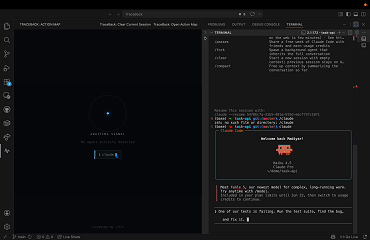

<div align="center">

# TraceBack

**Real-time observability for AI coding agents — inside VS Code.**

[](https://github.com/madiyarzm/TraceBack/actions/workflows/ci.yml)
[](LICENSE)
[](https://code.visualstudio.com)
[](https://www.typescriptlang.org)
[](https://reactjs.org)

</div>

---

You started a Claude Code session and walked away. The agent is reading files, running commands, making edits. Five minutes later you come back — and you have no idea what it did.

**TraceBack fixes that.** It hooks directly into Claude Code's hook system and streams every tool call into a live, scrolling action timeline in your VS Code sidebar — with anomaly detection that catches loops, error storms, and silent stalls *while the agent is still running*.

> _"What did my agent just do? Why is it stuck? Did it loop? What file did it touch?"_ — answered in real time, without leaving your editor.

---

## Demo

<div align="center">
  
</div>

---

## Why TraceBack?

Most "agent observability" tools (Langfuse, Arize, LangSmith) ship cloud dashboards meant for production traffic. TraceBack is the opposite: **local-first, in-editor, zero-setup, real-time**, focused on the dev loop.

| | Cloud dashboards | Terminal output | **TraceBack** |
|---|---|---|---|
| Setup | API keys, SDKs, project ids | none | **zero** — auto-installs hooks |
| Latency | seconds | live but ephemeral | **live** + scrollable |
| Loop / stall detection | none | none | **built-in** |
| Multi-agent visibility | one project per dashboard | one terminal each | **fleet view in one panel** |
| Token / cost view | yes | no | **real usage from transcript** |
| Cost | $$$ tier | free | **free, local** |

---

## Quickstart

```bash
# 1. Clone & install
git clone https://github.com/madiyarzm/TraceBack
cd TraceBack
npm install
cd webview && npm install && cd ..

# 2. Build
npm run compile && npm run build:webview

# 3. Open in VS Code and press F5
#    (launches the Extension Development Host with TraceBack loaded)
```

Click the TraceBack icon (`$(pulse)`) in the activity bar, then run any Claude Code session in your terminal. Tool calls will start appearing in the sidebar as they happen.

---

## How it works

TraceBack injects lightweight `curl` hooks into `~/.claude/settings.json` on activation. Every time Claude Code fires `PreToolUse`, `PostToolUse`, `PostToolUseFailure`, or `Stop`, the hook payload is `POST`ed to a local HTTP server on `localhost:7777`. The extension parses those events, builds a session timeline, and streams updates into a React webview rendered in the VS Code sidebar.

```
Claude Code CLI
    │  PreToolUse / PostToolUse / PostToolUseFailure / Stop hook fires
    │  curl → POST localhost:7777/event
    ▼
TraceBack server  (Node.js, in-process)
    │  parses payload → TraceEvent
    ▼
TraceStore  (in-memory session state) ──► AnomalyDetector  (pure, tail-only, O(1))
    │  onDidUpdate event
    ▼
Webview  (React + Vite)
    └─ live timeline + metrics odometer, rendered in the sidebar
```

No sockets between extension and webview — just VS Code's `postMessage`. No polling. Zero latency between a tool call firing and the card appearing in the timeline.

---

## Features

### Live action timeline
Every tool call renders as a card — `pending → success / error` — in real time. Click any card to inspect the full tool input and output inline. File edits (`Edit`, `Write`, `MultiEdit`) render as a Git-style line diff.

### Anomaly engine
A pure, tail-only detector that re-evaluates on every event in O(1). Catches three failure modes automatically:

- **Repeater** — 4 identical tool calls in a row (the agent is stuck in a loop).
- **Error thrash** — 3 consecutive failed tool calls (the agent is making things worse).
- **Silent stall** — a tool call pending for more than 60 seconds with no response.

Anomalies fire a native VS Code notification (even with the sidebar hidden), permanently tag the implicated cards, and count on the odometer. Live alerts self-clear the moment the condition stops holding — the evidence trail doesn't.

### Breakpoints for running agents
Hit **⏸ pause** and the agent freezes at its next tool call — TraceBack holds the hook's HTTP response open, exactly like a breakpoint in a debugger. Inspect the timeline, then **▶ resume**… or type into the redirect box:

> _"Stop trying to install that package — use the native library instead."_

Your message is delivered into the agent's context as the reason its call was denied. The agent reads it and changes course, mid-run. Human-in-the-loop steering for black-box agents.

### Tripwires
Policy rules that protect **every session at once**, no human watching:

```jsonc
"traceback.tripwires": [
  { "tool": "Bash",       "pattern": "rm -rf|sudo ", "reason": "Destructive commands are blocked." },
  { "tool": "Edit|Write", "pattern": "\\.env|prod/", "reason": "Don't touch secrets or prod config." }
]
```

A matching call is denied *before it executes* via Claude Code's hook decision protocol, the agent is told why, and you get a notification. The CLI asks per session, interactively; tripwires are fleet-wide policy.

### Multi-agent fleet view
Run multiple Claude Code sessions in parallel? TraceBack lists all of them in a dropdown with live status badges (🟢 running, ⚪ done, 🔴 anomalous). Background anomalies surface as a pulsing pill next to the dropdown — you see a failure in agent #3 even while watching agent #1.

### Real token & cost metrics
Pulls actual token usage from the Claude Code transcript (`input + cache_read + cache_creation + output`) instead of estimating. Falls back to a character-based heuristic when the transcript isn't reachable.

### Narrative Engine *(optional)*
Connect a Groq or local Ollama instance and TraceBack generates a 1–2 sentence plain-English summary of the session after each tool call. _"It's been reading config files and is about to make its first edit."_

### Chat assistant *(optional)*
Ask questions about the current session directly in the webview. _"Why did the agent fail?"_, _"What files were touched?"_, _"Is this loop intentional?"_ — answered with the timeline already loaded as context.

### Curated payloads & copy-everything
Expanded cards show purpose-built views instead of raw dumps: Bash commands with exit pills, file ops with line/byte metrics, web calls as chips, plus a deterministic one-line outcome (`→ Error: Exit code 1 · npm error Missing script`). Raw input/output stays one click away — and everything is copyable: single outputs, single commands, or the **entire session as a markdown report** (`MD` button) ready to paste into a GitHub issue or hand to a fresh agent session as context.

### Export
Snapshot the current timeline as a PNG or dump the raw session JSON — useful for bug reports, post-mortems, and sharing with teammates.

### Auto hook management
TraceBack surgically adds and removes only its own entries in `~/.claude/settings.json` — never touches unrelated config.

---

## Requirements

| Requirement | Version |
|---|---|
| VS Code | `^1.85.0` |
| [Claude Code CLI](https://docs.anthropic.com/en/docs/claude-code) | latest |
| `curl` | on `PATH` |
| Node.js *(dev only)* | `^20` |
| Groq API key or Ollama *(optional)* | for Narrative Engine |

---

## Installation

### From source (recommended while pre-release)

```bash
git clone https://github.com/madiyarzm/TraceBack
cd TraceBack
npm install && cd webview && npm install && cd ..
npm run compile && npm run build:webview
```

Open the repo in VS Code and press **F5** to launch the Extension Development Host. To install it permanently:

```bash
npm run package                           # produces traceback-0.1.0.vsix
code --install-extension traceback-0.1.0.vsix
```

---

## Commands

| Command | Description |
|---|---|
| `TraceBack: Open Action Map` | Open the action map in a full editor panel |
| `TraceBack: Clear Current Session` | Reset the current session timeline |
| `TraceBack: Start Listening` | Start the local server and install hooks |
| `TraceBack: Stop Listening` | Stop the local server and remove hooks |

---

## Configuration

All settings live under `traceback.*` in VS Code settings.

| Setting | Default | Description |
|---|---|---|
| `traceback.port` | `7777` | Port the hook server listens on |
| `traceback.autoInstallHooks` | `true` | Auto-install hooks on activation |
| `traceback.llmProvider` | `"disabled"` | Narrative Engine: `"disabled"`, `"groq"`, or `"ollama"` |
| `traceback.groqApiKey` | `""` | Groq API key |
| `traceback.groqModel` | `"llama-3.1-8b-instant"` | Groq model for summaries and chat |
| `traceback.ollamaModel` | `"llama3.2"` | Ollama model (must be pulled locally) |
| `traceback.ollamaPort` | `11434` | Ollama port |
| `traceback.tripwires` | `[]` | Policy rules that block matching tool calls before execution |

### Enabling the Narrative Engine

The AI helper (plain-English summary + sidebar chat) is **opt-in** and supports two backends. You can configure it via VS Code settings *or* a local `.env` file at the repo root — whichever is easier.

#### Option A — Groq (cloud, free tier, recommended)

1. Sign up at [**console.groq.com**](https://console.groq.com) — it's free, no credit card required.
2. Open the menu in the top-right corner → **API Keys** → **Create API Key**.
3. Copy the generated key (starts with `gsk_…`).
4. Drop it into a `.env` file at the repo root:

   ```bash
   cp .env.example .env
   # then edit .env and paste your key
   ```

   ```dotenv
   # .env
   GROQ_API_KEY=gsk_your_key_here
   # GROQ_MODEL=llama-3.1-8b-instant   # optional override
   ```

5. Reload the VS Code window (`Cmd+R` in the Extension Development Host). TraceBack will auto-detect the key, log `Loaded .env keys: GROQ_API_KEY` to its output channel, and start producing live narrative summaries.

> `.env` is git-ignored. The only env file ever committed is `.env.example`.

If you'd rather use VS Code settings (e.g. for a team-shared workspace), the equivalent is:

```jsonc
{
  "traceback.llmProvider": "groq",
  "traceback.groqApiKey":  "gsk_..."
}
```

VS Code settings always override `.env` when both are set.

#### Option B — Ollama (fully local, no API key)

Install Ollama from [ollama.com](https://ollama.com), pull a model, then:

```jsonc
{
  "traceback.llmProvider": "ollama",
  "traceback.ollamaModel": "llama3.2"
}
```

or in `.env`:

```dotenv
OLLAMA_MODEL=llama3.2
# OLLAMA_PORT=11434
```

---

## Architecture

```
src/
├── extension.ts        # activation, command registration, LLM wiring
├── server.ts           # HTTP server that receives Claude Code hook payloads
├── traceStore.ts       # session state, node building, batch grouping
├── anomalyDetector.ts  # pure tail-only detector: repeater / error_thrash / stall
├── tokenReader.ts      # tails the Claude transcript for real token usage
├── hookManager.ts      # reads/writes ~/.claude/settings.json
├── llmClient.ts        # Groq + Ollama abstraction
├── envLoader.ts        # tiny zero-dep .env loader (workspace + extension root)
└── webviewProvider.ts  # bridges the extension ↔ React webview

webview/src/
├── App.tsx                       # fleet state machine, scroll/follow logic
├── metrics.ts                    # session metrics (duration, tokens, cost)
└── components/
    ├── TimelineCard.tsx          # one tool call → one card
    ├── SessionOdometer.tsx       # sticky metrics bar (time / actions / errors / tokens)
    ├── SessionPicker.tsx         # multi-session dropdown with status badges
    ├── DiffViewer.tsx            # LCS line diff for Edit/Write
    ├── Toolbar.tsx               # LIVE/DONE pill + export/clear buttons
    └── EmptyState.tsx
```

Extension ↔ webview communicate exclusively over `postMessage` / `onDidReceiveMessage`. No sockets, no shared memory — just clean VS Code API primitives.

---

## Development

```bash
npm run watch          # tsc -w  (extension host, incremental)
npm run dev:webview    # vite dev server (webview HMR)

npm run compile        # full extension build
npm run build:webview  # full webview build
npm test               # vitest unit tests
npm run lint           # eslint
```

Press **F5** in VS Code to launch the Extension Development Host with the extension loaded.

### Testing

Unit tests cover the pure modules — the anomaly detector and the trace store — and run on every push via GitHub Actions on Node 20 and 22.

```bash
npm test           # one-shot
npm run test:watch # watch mode
```

---

## Roadmap

- **OpenTelemetry GenAI spans.** Emit `gen_ai.*`-tagged spans per session/tool call so TraceBack can forward to Langfuse / Phoenix / Honeycomb while staying the live local viewer.
- **Beyond Claude Code.** Generic OTLP-shaped adapter so any agent (LangGraph, OpenAI Agents SDK, MCP servers) can stream into TraceBack.
- **Persistent session history.** Save sessions to disk for post-hoc audit and replay.
- **Smarter stumbles.** Near-duplicate edits, thrashing on the same file, runaway cost detection.

---

## License

[MIT](LICENSE) — built by [Madiyar Zhunussov](https://github.com/madiyarzhunussov).
