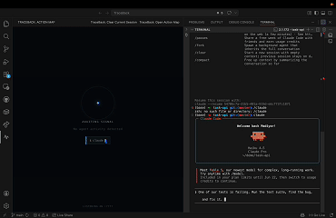

<div align="center">

# TraceBack

**See what your AI coding agent actually did — and steer it — from inside VS Code.**

[](https://github.com/madiyarzm/TraceBack/actions/workflows/ci.yml)
[](LICENSE)
[](https://code.visualstudio.com)

</div>

---

You start a Claude Code session and step away. It reads fourteen files, runs some commands, edits four, and greets you with **"All done!"** — and you have no idea what actually changed, why, or whether any of it was checked.

**TraceBack turns that session into something you can review.** Your prompts become chapters, the agent's work groups under the tasks it declared, and when the run ends you get a **net-change diff per file** — the true before-and-after, annotated with the agent's own reasoning and a badge for whether anything verified it.

It also lets you **step in**: pause a running agent at its next action, redirect it mid-run, or set guards that block dangerous calls automatically.

> Claude Code's transcript shows the agent *working*. TraceBack shows **what changed, why, and whether it was checked** — so you stay the engineer, not a spectator.

---

## Demo

<div align="center">
  
</div>

---

## Why not just use a dashboard?

Most "agent observability" tools (Langfuse, Arize, LangSmith) are cloud dashboards that tell you *how much* — tokens, latency, spend. TraceBack answers a different question for the single developer in the loop: **what changed, and can I trust it?**

| | Cloud dashboards | Terminal output | **TraceBack** |
|---|---|---|---|
| Setup | API keys, SDKs | none | **zero — auto-installs hooks** |
| Answers | how much | what, right now | **what changed, why, verified?** |
| Net diff per file | ✗ | ✗ | **✓ baseline → now, with reasoning** |
| Steer a running agent | ✗ | ✗ | **✓ pause · redirect · guards** |
| Cost | $$$ | free | **free, local** |

---

## Quickstart

```bash
git clone https://github.com/madiyarzm/TraceBack
cd TraceBack
npm install && cd webview && npm install && cd ..
npm run compile && npm run build:webview
```

Open the repo in VS Code and press **F5** to launch the Extension Development Host. Click the TraceBack icon (`$(pulse)`) in the activity bar, then run any Claude Code session in your terminal — tool calls appear in the sidebar as they happen.

To install it permanently:

```bash
npm run package                       # builds traceback-<version>.vsix
code --install-extension traceback-*.vsix
```

---

## How it works

On activation, TraceBack adds lightweight `curl` hooks to `~/.claude/settings.json`. Every Claude Code lifecycle event (`UserPromptSubmit`, `PreToolUse`, `PostToolUse`, `Stop`) is `POST`ed to a local server, parsed into a session timeline, and streamed into a React webview.

```
Claude Code CLI
   │  hook fires → curl POST 127.0.0.1:7777/event
   ▼
TraceBack server (in-process Node) → TraceStore → AnomalyDetector
   │  postMessage
   ▼
Webview (React) — prompt chapters, net-change review, controls
```

The server binds `127.0.0.1` only and refuses any request carrying an `Origin` header, so a browser can't reach it. Extension ↔ webview talk over VS Code's `postMessage` — no sockets, no polling. Hooks are removed again when the extension is disabled or uninstalled.

---

## What you get

**Review, not replay**

- **Prompt chapters** — each prompt opens a chapter; the agent's work groups under the tasks it declared. No plan? Actions still fall into tidy Reading / Editing / Running blocks.
- **Net-change review** — one net diff per file (baseline → now), each carrying the agent's reasoning, the failing command that triggered it, and a verification badge.
- **Verification badges** — per file: **verified** (a test/build ran after the last edit and passed), **failing**, or **unverified**. *"2 of 5 changed files never checked"* is the sentence that decides whether you commit.
- **Decision & assumption ledger** — the judgment calls the agent makes in prose (*"I'll assume the config stays JSON"*) mined from the transcript, so you catch a wrong assumption before three files calcify around it.
- **Replay** — step through a finished session like a debugger; every view recomputes from the slice, so the whole session time-travels together.

**Catch trouble**

- **Anomaly engine** — deliberately quiet. Flags near-duplicate loops, error thrash, context spirals, and scope creep — but treats a stall as *"waiting on you"*, not a red alarm, since it usually means a permission prompt.
- **Files touched, not just changed** — a tree of everything the agent *read*, too. *"It read fourteen files for a two-line change"* is a coupling insight no chronological view surfaces.

**Step in**

- **Breakpoints** — hit **⏸ pause** and the agent freezes at its next tool call (TraceBack holds the hook's HTTP response open, exactly like a debugger). **▶ resume**, or type into the redirect box — your message reaches the agent as the reason its call was denied, and it changes course mid-run.
- **Guards** — policy rules that protect *every* session with no human watching: never delete files, stay in the project folder, protect `.env`, no push to `main`. Add your own as regexes. A matching call is denied before it runs, with the reason fed back to the agent.

**Understand & share**

- **Multi-agent fleet view** — run several sessions in parallel; each gets a distinct color + tag and a live status.
- **Real token & cost metrics** — pulled from the Claude Code transcript, not estimated.
- **Export** — one menu, four formats: JSON, Markdown (a post-mortem for a GitHub issue or handoff), a self-contained HTML page, or a PNG.
- **Narrative Engine & chat** *(optional)* — connect Groq or a local Ollama for plain-English summaries and a session Q&A helper.

---

## Pro tip — richer traces with one CLAUDE.md line

TraceBack shows the sentence the agent writes right before each tool call as that step's *intent*. Make it a habit by adding this to your `~/.claude/CLAUDE.md` or a project `CLAUDE.md`:

```markdown
## Working style
- Before each tool call, state in one concise sentence what you are about to
  do and why. No filler like "Perfect!" or a bare "Now let me...".
- When you make a judgment call (an assumption, a trade-off, choosing one
  approach over another), say so explicitly in prose.
```

The first line feeds the intent subtitle on every card; the second feeds the decision & assumption ledger.

---

## Configuration

All settings live under `traceback.*`. The essentials:

| Setting | Default | Description |
|---|---|---|
| `traceback.port` | `7777` | Port the hook server listens on |
| `traceback.autoInstallHooks` | `true` | Auto-install hooks on activation |
| `traceback.llmProvider` | `"disabled"` | Narrative Engine: `"disabled"`, `"groq"`, or `"ollama"` |
| `traceback.guards` | `{}` | Toggles for built-in guards |
| `traceback.customGuards` | `[]` | Custom deny regexes, e.g. `["rm -rf|sudo ", "curl.*prod"]` |

<details>
<summary><b>Enabling the Narrative Engine (Groq or Ollama)</b></summary>

The AI summary + chat helper is opt-in. Configure it via VS Code settings *or* a `.env` file at the repo root.

**Groq (cloud, free tier):** sign up at [console.groq.com](https://console.groq.com), create an API key (`gsk_…`), then:

```dotenv
# .env  (git-ignored)
GROQ_API_KEY=gsk_your_key_here
```

Reload the window (`Cmd+R` in the dev host). The VS Code equivalent is `"traceback.llmProvider": "groq"` + `"traceback.groqApiKey": "gsk_..."`; settings override `.env`.

**Ollama (fully local):** install from [ollama.com](https://ollama.com), pull a model, then set `"traceback.llmProvider": "ollama"` and `"traceback.ollamaModel": "llama3.2"`.

</details>

---

## Development

```bash
npm run watch          # tsc -w (extension host)
npm run dev:webview    # vite dev server (webview HMR)
npm run compile        # full extension build
npm run build:webview  # full webview build
npm test               # vitest (150+ tests)
npm run lint           # eslint
```

The derivation modules — `chapters.ts`, `review.ts`, `fileChanges.ts`, `anomalyDetector.ts` — are pure functions over the event list, which is why replay is nearly free and why they carry the bulk of the suite. Tests run on Node 20 and 22 via GitHub Actions on every push.

---

## Roadmap

- **Beyond Claude Code** — a generic OTLP-shaped adapter so any agent (LangGraph, OpenAI Agents SDK, MCP servers) can stream into the same chapter/review views.
- **Review for archived sessions** — persist baseline snapshots so net-change review works on history, not just live runs.
- **LLM-assisted ledger** — an optional offline pass to catch judgment calls the regex miner misses.

---

## License

[MIT](LICENSE) — built by [Madiyar Zhunussov](https://github.com/madiyarzhunussov).
